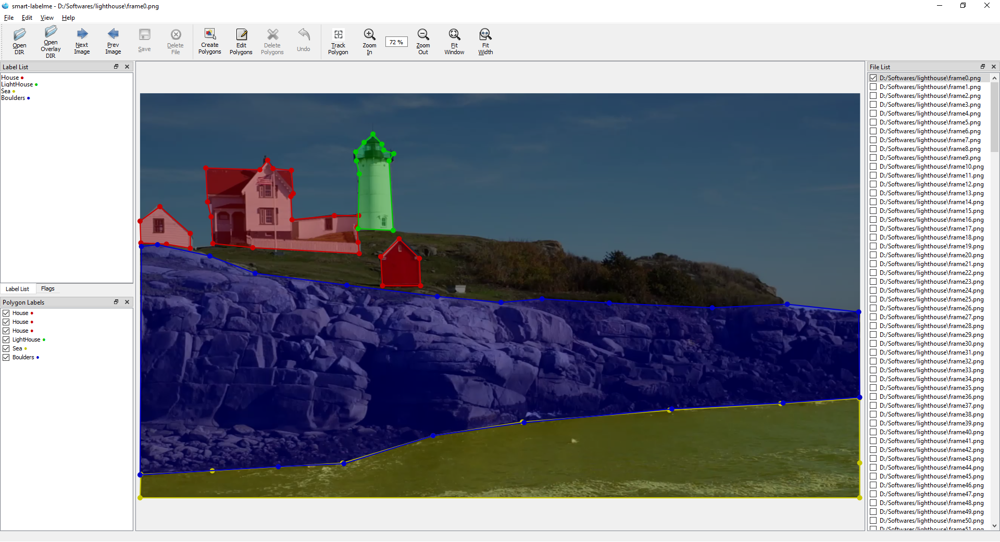

<h1 align="center">
  <br/>labelme
</h1>

<h4 align="center">
  Video / Image Annotation (Polygon, Semantic mask, Classification) with Python
</h4>

<br/>

<div align="center">
  
</div>

## Description

Smart-Labelme is a graphical image annotation tool inspired by <https://github.com/wkentaro/labelme>.  
It is written in Python and uses Qt for its graphical interface.

   
<i>Auto contouring feature using OpenCV grab cut</i>

   
<i>Auto tracking of polygons between frames</i>


## Features

- [x] Image annotation for polygon, rectangle, circle, line and point.
- [x] Image flag annotation for classification and cleaning.
- [x] Auto-contouring for fast polygon annotation.
- [x] Auto tracking to track and copy polygon annotations between frames.
- [x] Scripts for semantic segmentation creation from polygonal annotations.
- [x] Video annotation. 
- [x] GUI customization (predefined labels / flags, auto-saving, label validation, etc).
- [x] Exporting VOC-format dataset for semantic/instance segmentation.
- [x] Exporting COCO-format dataset for instance segmentation.


## Requirements

- Ubuntu / macOS / Windows
- Python2 / Python3
- [PyQt4 / PyQt5](http://www.riverbankcomputing.co.uk/software/pyqt/intro) / [PySide2](https://wiki.qt.io/PySide2_GettingStarted)


## Installation

There are options:

- Platform agonistic installation: [Anaconda](#anaconda)
- Platform specific installation: [Ubuntu](#ubuntu), [Windows](#windows)

### Anaconda

You need install [Anaconda](https://www.continuum.io/downloads), then run below:

```bash
# python3
conda create --name=smart-labelme python=3.6
source activate smart-labelme
pip install smart-labelme
```

### Ubuntu

```bash
# Ubuntu 14.04 / Ubuntu 16.04
# Python3
sudo apt-get install python3-pyqt5  # PyQt5
sudo pip3 install smart-labelme
```

### Ubuntu 19.10+ / Debian (sid)

```bash
sudo apt-get install smart-labelme
```

### Windows

Firstly, follow instruction in [Anaconda](#anaconda).

```bash
conda install pillow=4.0.0
```


## Usage

Run `smart_labelme --help` for detail.  
The annotations are saved as a [JSON](http://www.json.org/) file.

```bash
smart_labelme  # just open gui

### Command Line Arguments
- `--output` specifies the location that annotations will be written to. Annotations will be stored in this directory with a name that corresponds to the image that the annotation was made on.
- The first time you run labelme, it will create a config file in `~/.labelmerc`. You can edit this file and the changes will be applied the next time that you launch labelme. If you would prefer to use a config file from another location, you can specify this file with the `--config` flag.
- Without the `--nosortlabels` flag, the program will list labels in alphabetical order. When the program is run with this flag, it will display labels in the order that they are provided.
- Flags are assigned to an entire image. 
- Labels are assigned to a single polygon.

## Developing

```bash
git clone https://github.com/bhavyaajani/smart-labelme
cd smart-labelme
```

## Acknowledgement

This repo is the fork of [wkentaro/labelme](https://github.com/wkentaro/labelme).


## Cite This Project

If you use this project in your research or wish to refer to the baseline results published in the README, please use the following BibTeX entry.

```bash
@misc{smart-labelme2020,
  author =       {Bhavya Ajani},
  title =        {{Smart-labelme: Video / Image Annotation (Polygon, Semantic mask, Classification) with Python}},
  howpublished = {\url{https://github.com/bhavyaajani/smart-labelme}},
  year =         {2020}
}
```

```bash
@misc{labelme2016,
  author =       {Kentaro Wada},
  title =        {{labelme: Image Polygonal Annotation with Python}},
  howpublished = {\url{https://github.com/wkentaro/labelme}},
  year =         {2016}
}
```
